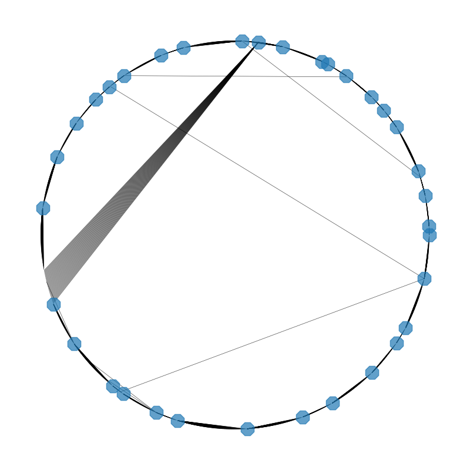
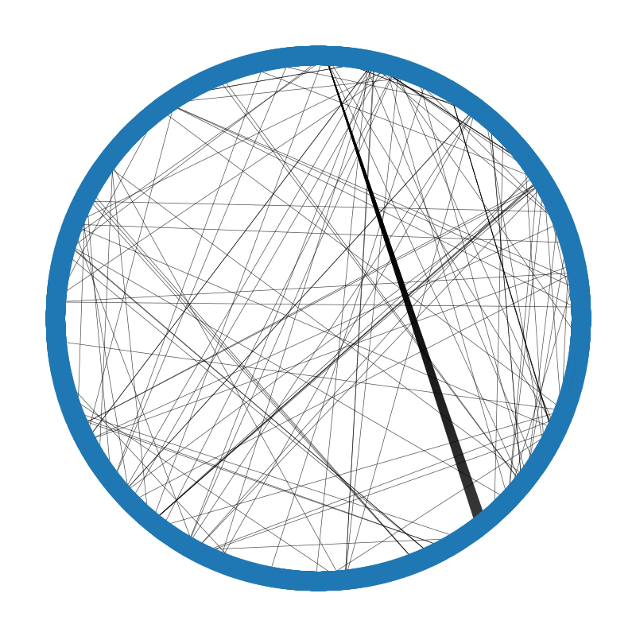

The Readme file
# BeagleTM2: PubMed Interactive Knowledge Discovery
## Date: 26 November 2023
### Oliver Bonham-Carter, [Allegheny College](https://allegheny.edu/)
### email: obonhamcarter@allegheny.edu

---
*Automatically read the works of hundreds of thousands of researchers to see how their ideas connect to other researchers!*


---

## Table of contents

* [Overview](#overview)
    * [Relationship Networks](#relationship-networks)
    * [Connectivity Networks](#connectivity-networks)
    * [Overview](#overview)
    * [Running the Software](#running-the-software)
    * [Functions](#functions)
    * [Command Summary](#command-summary)
    * [Corpus](#corpus)
    * [Setting up the Corpus](#Setting-up-the-corpus)
    * [Citations](#citations)
## Overview

BeagleTM is an interactive text mining tool to facilitate discovery of knowledge in [PubMed](https://pubmed.ncbi.nlm.nih.gov/) peer-reviewed articles. In addition to locating the articles according to their abstracts, BeagleTM also connects articles based by the common language between them. The results of BeagleTM are connected networks which could be used as a starting place for a literature review at the beginning of the project.

BeagleTM Named after my puppy Beagle, Flint, who spends all his time rooting all around with his nose to the ground. By an exhaustive study of seemingly all words of the abstracts of articles, connections and discoveroies can be made between references.

BeagleTM has been designed to discover knowledge in PubMed articles and supporting references for the convenient creation of sophisticated literature reviews. The data for BeagleTM comes from curated article data made available from PubMed's [ftp site at ftp://ftp.ncbi.nlm.nih.gov/pub/pmc/oa_bulk/](ftp://ftp.ncbi.nlm.nih.gov/pub/pmc/oa_bulk/).

Text mining article information with BeagleTM involves two steps: _Parsing_ and _Analyzing_. During _parsing_, abstracts from the corpus documents are checked for their keyword content. Results are saved in an output document which undergo _analysis_ to find relationship networks (i.e., the interconnections between the knowledge of articles according to keyword content). These inter-relationships concern common themes of studies, articles of similar keywords, articles which are connected by common references and other types of bridges that serve to combine the intricate facts of knowledge areas.

### Relationship Networks

A relationship network displays the connected information as obtained with keywords. The network includes the main articles for which the keywords are relevant, and their supporting references in which the keywords are likely to be relevant. Networks are written in `html` files and are to be opened in a browser, shown in Figure 1, each node of a network is labeled with PubMed’s PMID identifier number that serves to hyperlink nodes to articles at PubMed.

There are two types of nodes available in the networks: red and blue, for main and supporting reference articles, respectively. We note that the keywords are present in abstracts of main articles (red nodes), whereas they are not necessarily a part of supporting documents (blue nodes).


Figure 1: The articles relating to keywords create a body of knowledge. Main articles (red nodes, found by keyword content) are connected to their reference (blue nodes) articles. In networks, we are able to visualize which blue nodes serve as bridges for more than one red node to suggest that these references may be important bridges between works.


Shown in Figure 2, a mouse-over action of each node shows some metadata behind the nodes. In the case of red nodes (main articles), a title may be displayed which also serves as a link to the article at PubMed. In the case of blue nodes (reference articles), only a link to the article at PubMed may be obtained; the title information was not available during the text-mining process of the articles.


Figure 2: A screenshot of the red (main articles) and blue (supporting references). A mouse-over gives a title and link for red nodes and only a link for blue nodes.

Heatmaps are also available in which articles may be discovered according to their counts of supplied keywords, as shown in Figure 3.

---

### Connectivity Networks

We may use Connectivity Networks to gain an understanding about the amount of common material that exists between articles in terms of the utilization of their keywords. While, we do not get the titles of the articles themselves (see Relationship Networks for this information), we are able to estimate the amount of coverage there is for selected keywords. Note: in many cases, the fewer keywords allow for more specific focus with these kinds of networks.

We use *Connectivity Networks* to get a birds eye view of the numbers of keywords that are present in an article. Other articles with the same keywords share an edge. A Connectivity Network is shown in Figure 3. In the plot, each article in the corpus that contains keywords from the search align the circle. The nodes are the articles where several keywords were found simultaneously, and are therefore more influential articles due to their abundance of selected keywords.



Figure 3: Aligning the circle are all found articles from the literature in which keywords from the search were found. The nodes represent the articles having at least a specified number keywords in the article, and the edges connect these articles to other articles with the same keywords. Note: node degree threshold can be changed in the `networkBuilder.py` on the line beginning with, `row["degree"] > 3:`. These nodes therefore represent the articles which are more closely tied to the searchable keywords and each other.


Figure 4: Here we note a larger, more tied-up Connectivity Network wih respect to their associated search keywords across the literature. The number of edges suggests that there are many more articles which share a common usage of keywords.

---

## Running the Software

There are three main functions of the software.

### Functions

* *Parser* to find keywords in articles and create own data files for later analysis 
    + Parser: App for searching for keywords in articles. Note: you must include a file containing keywords (where each keyword is on own line of the text file).
* Data *Browser*
    + Browser: Streamlit App to visualize data after parsing jobs
* Stand alone network builder to complete the same networks as the browser but without *having to use* the browser. This feature allows network-building jobs to be automatically run in a pipeline from the command line.

### Initial Installations

After cloning this repository to your computer, please complete the following installations, if not done previously, before starting the work on the assignment:

- Install Python. Please see:
  - [Setting Up Python on Windows](https://realpython.com/lessons/python-windows-setup/)
  - [Python 3 Installation and Setup Guide](https://realpython.com/installing-python/)
  - [How to Install Python 3 and Set Up a Local Programming Environment on Windows 10](https://www.digitalocean.com/community/tutorials/how-to-install-python-3-and-set-up-a-local-programming-environment-on-windows-10)
- Install `VSCode` or another editor, as necessary. See [Getting Started with Python in VS Code](https://code.visualstudio.com/docs/python/python-tutorial)


### Command Summary

* The whole project was written in poetry. To engage poetry initially, use the following command from the root of the project. Note: the *root of the project* is the directory where the file, `pyproject.toml` resides.

`poetry install`

Below are commands to run BeagleTM2 using a Docker container which houses all necessary libraries and software for BeagleTM.

* Help to run the project.

``` bash
poetry run beagletm2 --help
```

* See commands with example parameters with a demo data file

``` bash
poetry run beagletm2 --bighelp
```

* Execute, process abstracts only

``` bash
poetry run beagletm2 --client parser --data-file kw_short.md --abs-only
```

* Execute, process abstracts only and create db from results.

``` bash
poetry run beagletm2 --client parser --data-file kw_short.md --make-db --abs-only
```

* Execute, process whole articles.

``` bash
poetry run beagletm2 --client parser --data-file kw_short.md --no-abs-only
```

* Execute, process whole articles and create db from results of smaller size. (Most commonly used 😃)

``` bash
poetry run beagletm2 --client parser --data-file kw_short.md --make-db --no-abs-only --save-less
```

* Execute the former browser app

``` bash
poetry run beagletm2 --client browser
```

* Execute the new browser app
``` bash
poetry run beagletm2 --client nbrowser
```

* Network builder -- builds maps without Streamlit. Build plots: Note the input csv files from this are the query files which are outputted from the Streamlit app. This option produces files containing nodes, analysis and figures.

``` bash
poetry run beagletm2  --client builder --data-file pmidsRefs_observed_patterns.csv
```

* Query keywords in database -- builds the csv files used to produce nodes and plots using the builder option.

``` bash
poetry run beagletm2  --client query --data-file ./data kw_short_analysis_out_save-less.sqlite3 --words-to-query-file wordsToQuery.md --makeplots
```

## Run a series of tasks

If you want to run several different jobs using the same corpus, create a batch file (unix) with the code shown below. Note, all updates from the running code are stored in the 'log/' directory.

File: __command.sh__

``` bash 
mkdir log

mkdir 0_out

poetry run beagletm2 --client parser --data-file kw_genPurposeEthics.md --make-db --no-abs-only --save-less  1>log/1_gen.md 2>log/2_gen.md &

poetry run beagletm2 --client parser --data-file kwClimateChange_i.md --make-db --no-abs-only --save-less 1>log/1_climate.md 2>log/2_climate.md &
```

## Creating Network Plots

BeagleTM2 builds networks from the Streamlit app or by the command line. To build a automated system to make ring plots of the `csv`output files located in `0_out/`, use the following bash script.

``` bash
for x in `ls 0_out/*.csv`

do
    echo Processing File: $x
	poetry run beagletm2  --client builder --data-file $x
done
```

## Corpus

NCBI offers bulk downloads of literature in two types of packages: _commercial_ and _non-commercial_. Please see https://ftp.ncbi.nlm.nih.gov/pub/pmc/readme.txt for more information.

BeagleTM has been designed to work with the xml files which are found in the `*.tar.gz` files. These `tar.gz` files files may be found at the below online repositories.

* _Commercially_ available
  + https://ftp.ncbi.nlm.nih.gov/pub/pmc/oa_bulk/oa_comm/xml/

* _Non-Commercially_ availably
  + https://ftp.ncbi.nlm.nih.gov/pub/pmc/oa_bulk/oa_noncomm/xml/

* _FTP_ site
  + ftp://ftp.ncbi.nlm.nih.gov/pub/pmc

## Setting up the Corpus

+ Make a directory to store your downloaded files such as `src/myDownloadedCorpusFiles/` and use your browser to download the `tar.gz` data files from one of the above links. Be sure to store these files in a place where you can conveniently work with them. In addition, bash commands such as the below example may be employed to automate a download. This process cannot be easily automated due to changing filenames at the NCBI, but it might resemble the following

``` bash
wget https://ftp.ncbi.nlm.nih.gov/pub/pmc/oa_bulk/oa_comm/xml/oa_comm_xml.incr.2022-03-07.tar.gz
```

If using Linux or MacOS, Another way to untar the files in bulk is by the following script. This script code can be placed into a file (`bulkUntar.sh`) and run using the command, `sh bulkUntar.sh` at the (Unix) terminal and will place the files into separate directories which must be placed into the `corpus/` directory.

``` bash
for x in `ls *.tar.gz`
do
	tar -vxf $x
done
```

* Once these files have been downloaded, the `xml` files must be extracted (i.e., an untarring step). The command, `tar -zxvf filename.tar.gx` can handle this step. If there are several files, then wildcards may be used: `tar -zxvf *.tar.gz`. This untarring step can be run in the Docker container which is automatically setup with `untar`.

* Once the xml files have been extracted, move/copy them to `beagleTM2/src/corpus/` so that BeagleTM2 will be able to find the corpus of articles. Note: This path to the corpus directory has been hardcoded in the `parser.py`, can can be changed as necessary (see `CORPUS_DIR` variable).

## Citations

* Bonham-Carter, Oliver. "BeagleTM: An adaptable text mining method for relationship discovery in literature." Advances in Information and Communication: Proceedings of the 2020 Future of Information and Communication Conference (FICC), Volume 2. Springer International Publishing, 2020.

* (Accepted) Bonham-Carter, Oliver. "Text Analysis of Ethical Influence in Bioinformatics and its Related Disciplines." Advances in Information and Communication: Proceedings of the 2024 Future of Information and Communication Conference (FICC), Springer International Publishing, 2024.

## A work in progress

Check back often to see the evolution of the project!! BeagleTM is a work-in-progress. Updates to the methods and tests for the code will come soon and I will continue to update the repository with updates. If you would like to contribute to this project, __then please do!__ For instance, if you see some low-hanging fruit or task that you could easily complete, that could add value to the project, then I would love to have your insight.

Otherwise, please create an Issue for bugs or errors. Since I am a teaching faculty member at Allegheny College, I may not have all the time necessary to quickly fix the bugs and so I would be very happy to have any help that I can get from the OpenSource community for any technological insight. Much thanks in advance. I hope that this project helps you find the knowledge from PubMed that you require for your project. :-)
