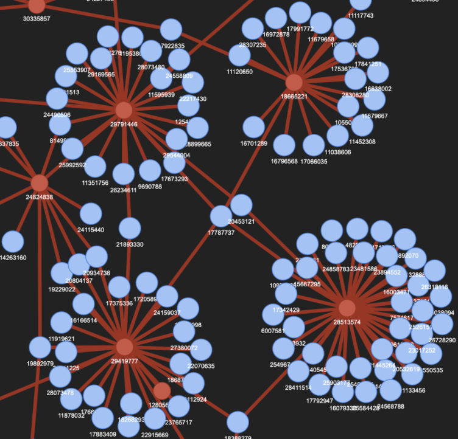
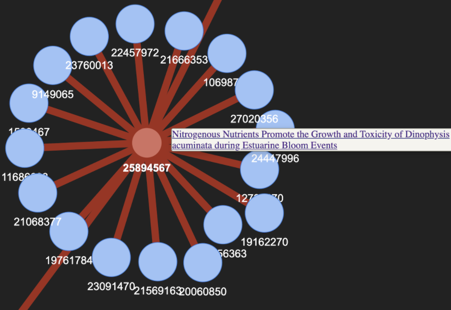

The Readme file
# BeagleTM2: PubMed Interactive Knowledge Discovery
## Date: 1 Sept 2023
### Oliver Bonham-Carter, [Allegheny College](https://allegheny.edu/)
### email: obonhamcarter@allegheny.edu


Special note: files containing code from the former BeagleTM have been temporarily added.
The below files for browser are to be removed or reworked.
+ beagleTM_browser.py
+ beagleTM_browser_helperCode.py
+ statEval.py


---

---


## Table of contents

* [Overview](#overview)
* + [Relationship Networks](#relationship-networks)

## Overview

BeagleTM is an interactive text mining tool to facilitate discovery of knowledge in [PubMed](https://pubmed.ncbi.nlm.nih.gov/) peer-reviewed articles. In addition to locating the articles according to their abstracts, BeagleTM also connects articles based by the common language between them. The results of BeagleTM are connected networks which could be used as a starting place for a literature review at the beginning of the project.


BeagleTM Named after my puppy Beagle, Flint, who spends all his time rooting all around with his nose to the ground. By an exhaustive study of seemingly all words of the abstracts of articles, connections and discoveroies can be made between references.


BeagleTM has been designed to discover knowledge in PubMed articles and supporting references for the convenient creation of sophisticated literature reviews. The data for BeagleTM comes from curated article data made available from PubMed's [ftp site at ftp://ftp.ncbi.nlm.nih.gov/pub/pmc/oa_bulk/](ftp://ftp.ncbi.nlm.nih.gov/pub/pmc/oa_bulk/).

Text mining article information with BeagleTM involves two steps: _Parsing_ and _Analyzing_. During _parsing_, abstracts from the corpus documents are checked for their keyword content. Results are saved in an output document which undergo _analysis_ to find relationship networks (i.e., the interconnections between the knowledge of articles according to keyword content). These inter-relationships concern common themes of studies, articles of similar keywords, articles which are connected by common references and other types of bridges that serve to combine the intricate facts of knowledge areas.


### Relationship Networks

A relationship network displays the connected information as obtained with keywords. The network includes the main articles for which the keywords are relevant, and their supporting references in which the keywords are likely to be relevant. Networks are written in `html` files and are to be opened in a browser, shown in Figure 1, each node of a network is labeled with PubMed’s PMID identifier number that serves to hyperlink nodes to articles at PubMed.

There are two types of nodes available in the networks: red and blue, for main and supporting reference articles, respectively. We note that the keywords are present in abstracts of main articles (red nodes), whereas they are not necessarily a part of supporting documents (blue nodes).


Figure 1: The articles relating to keywords create a body of knowledge. Main articles (red nodes, found by keyword content) are connected to their reference (blue nodes) articles. In networks, we are able to visualize which blue nodes serve as bridges for more than one red node to suggest that these references may be important bridges between works.


Shown in Figure 2, a mouse-over action of each node shows some metadata behind the nodes. In the case of red nodes (main articles), a title may be displayed which also serves as a link to the article at PubMed. In the case of blue nodes (reference articles), only a link to the article at PubMed may be obtained; the title information was not available during the text-mining process of the articles.



Figure 2: A screenshot of the red (main articles) and blue (supporting references). A mouse-over gives a title and link for red nodes and only a link for blue nodes.

Heatmaps are also available in which articles may be discovered according to their counts of supplied keywords, as shown in Figure 3.


## Command Summary

There are two main functions of the software.

* Client: Parser or Browser
    + Parser: App for searching for keywords in articles. Note: you must include a keyword file.
    + Browser: App to visualize data after parsing job.


Below are commands to run BeagleTM using a Docker container which houses all necessary libraries and software for BeagleTM.


* Get help to run the program
```
poetry run beagletm2 --bighelp
```

* Execute, process abstracts only

    ```
    poetry run beagletm2 --client parser --data-file kw_short.md --abs-only
    ```

* Execute, process abstracts only and create db from results.
    ```
    poetry run beagletm2 --client parser --data-file kw_short.md --make-db --abs-only
    ```

* Execute, process whole articles.
    ```
    poetry run beagletm2 --client parser --data-file kw_short.md --no-abs-only
    ```

* Execute, process whole articles and create db from results of smaller size. (Most commonly used 😃)
    ```
    poetry run beagletm2 --client parser --data-file kw_short.md --make-db --no-abs-only --save-less
    ```

## Run a series of tasks

If you want to run several different jobs using the same corpus, create a batch file (unix) with the code shown below. Note, all updates from the running code are stored in the 'log/' directory.

File: __command.sh__

```
mkdir log
mkdir 0_out
poetry run beagletm2 --client parser --data-file kw_genPurposeEthics.md --make-db --no-abs-only --save-less  1>log/1_gen.md 2>log/2_gen.md &
poetry run beagletm2 --client parser --data-file kwClimateChange_i.md --make-db --no-abs-only --save-less 1>log/1_climate.md 2>log/2_climate.md &
```

To run the file using a unix OS, use the following command.

```
sh command.sh
```

## Creating Network Plots
BeagleTM2 builds networks from the Streamlit app or by the command line. To build a automated system to make ring plots of the `csv`output files located in `0_out/`, use the following bash script.

``` bash
for x in `ls 0_out/*.csv`

do
    echo Processing File: $x
	poetry run beagletm2  --client builder --data-file $x
done
```


## XML Data

NCBI offers bulk downloads of literature in two types of  packages: _commercial_ and _non-commercial_. Please see https://ftp.ncbi.nlm.nih.gov/pub/pmc/readme.txt for more information.

BeagleTM has been designed to work with the xml files which are found in the `*.tar.gz` files. These `tar.gz` files files may be found at the below online repositories.

+ _Commercially_ available
 + https://ftp.ncbi.nlm.nih.gov/pub/pmc/oa_bulk/oa_comm/xml/

+ _Non-Commercially_ availably
 + https://ftp.ncbi.nlm.nih.gov/pub/pmc/oa_bulk/oa_noncomm/xml/

+ _FTP_ site
 + ftp://ftp.ncbi.nlm.nih.gov/pub/pmc

## Setting up the corpus

+ Make a directory to store your downloaded files such as `src/myDownloadedCorpusFiles/` and use your browser to download the tar.gz data files from one of the above links. Be sure to store these files in a place where you can conveniently work with them. In addition, bash commands such as the below example may be employed to automate a download. This process cannot be easily automated due to changing filenames at the NCBI.

```
wget https://ftp.ncbi.nlm.nih.gov/pub/pmc/oa_bulk/oa_comm/xml/oa_comm_xml.incr.2022-03-07.tar.gz
```

If using Linux or MacOS, Another way to untar the files in bulk is by the following script. This script code can be placed into a file (`bulkUntar.sh`) and run using the command, `sh bulkUntar.sh` at the (Unix) terminal and will place the files into separate directories which must be placed into the `corpus/` directory.

``` bash
for x in `ls *.tar.gz`
do
	tar -vxf $x
done
```


+ Once these files have been downloaded, the `xml` files must be extracted (i.e., an untarring step). The command, `tar -zxvf filename.tar.gx` can handle this step. If there are several files, then wildcards may be used: `tar -zxvf *.tar.gz`. This untarring step can be run in the Docker container which is automatically setup with `untar`.

+ Once the xml files have been extracted, move/copy them to `beagleTM/src/corpus/` so that BeagleTM will be able to find them. This path to the corpus directory has been hardcoded in the `beagleTM2_parser_helperCode.py`, however, if using an external hard drive or similar, the corpus path could be altered by updating the global variable, `CORPUS_DIR` as shown below.

## A work in progress

Check back often to see the evolution of the project!! BeagleTM is a work-in-progress. Updates to the methods and tests for the code will come soon and I will continue to update the repository with updates. If you would like to contribute to this project, __then please do!__ For instance, if you see some low-hanging fruit or task that you could easily complete, that could add value to the project, then I would love to have your insight.

Otherwise, please create an Issue for bugs or errors. Since I am a teaching faculty member at Allegheny College, I may not have all the time necessary to quickly fix the bugs and so I would be very happy to have any help that I can get from the OpenSource community for any technological insight. Much thanks in advance. I hope that this project helps you find the knowledge from PubMed that you require for your project. :-)
